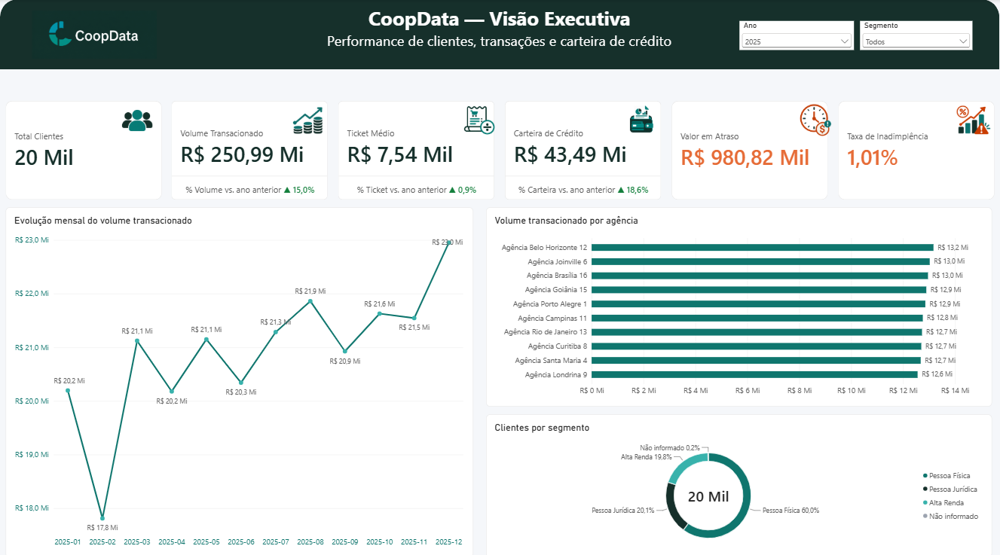

# CoopData — Análise de Dados de uma Cooperativa Financeira



## Sobre o projeto

O **CoopData** é um projeto autoral de portfólio que simula um ambiente de dados de uma cooperativa financeira. Meu com o projeto, foi transformar arquivos brutos de clientes, agências, produtos, transações, empréstimos e pagamentos em informações confiáveis para acompanhamento executivo.

O projeto percorre o fluxo completo de uma análise de dados: importação, exploração, avaliação de qualidade, tratamento em SQL, modelagem no Power BI, criação de medidas DAX e desenvolvimento de um dashboard interativo.

> Os dados utilizados são fictícios e destinados exclusivamente a fins educacionais e de portfólio.

## Problema de negócio

Para esse case, utilizei o fato da cooperativa precisar consolidar dados distribuídos em diferentes arquivos e responder a perguntas como:

- Qual é o volume financeiro transacionado?
- Como o volume evolui ao longo do tempo?
- Quais agências apresentam maior movimentação?
- Como a base de clientes está distribuída por segmento?
- Qual é o tamanho da carteira de crédito?
- Qual é o valor em atraso e a taxa de inadimplência?
- Quais registros podem comprometer a confiabilidade dos indicadores?

## Tecnologias utilizadas

- **SQL Server e SSMS:** Armazenamento, exploração, validação e tratamento dos dados;
- **SQL:** Consultas de qualidade, joins, CTEs, views, flags e regras de negócio;
- **Power BI:** Modelagem, relacionamento entre tabelas e visualização;
- **Power Query:** Conexão com as views tratadas e definição dos tipos;
- **DAX:** Indicadores em comparação com o ano anterior e cálculos temporais ;
- **Visual Studio:** Montagem do descritivo e detalhamento para publicação;
- **GitHub:** versionamento e apresentação do projeto.

## Conjunto de dados

| Domínio | Quantidade na camada raw |
|---|---:|
| Clientes | 20.050 |
| Agências | 20 |
| Produtos | 5 |
| Transações | 200.075 |
| Empréstimos | 8.000 |
| Pagamentos | 80.000 |

Os arquivos utilizados estão disponíveis em [`Data`](Data/).

## Etapas do projeto

### 1. Importação e validação

Os arquivos CSV foram carregados em tabelas com o sufixo `_raw`, visando identificação dos dados ainda brutos. Em seguida, foram verificadas as quantidades importadas, a estrutura das tabelas, os tipos de dados e a presença de valores nulos.

### 2. Diagnóstico de qualidade

Foram avaliados, entre outros pontos:

- identificadores duplicados ou conflitantes;
- cidades e segmentos ausentes;
- estados inválidos;
- datas futuras;
- eventos anteriores ao cadastro ou à contratação;
- valores monetários importados em escala incorreta;
- taxas importadas fora da escala decimal esperada;
- parcelas acima da quantidade contratada;
- coerência entre status, vencimento e data de pagamento;
- integridade das chaves de clientes, agências, produtos e empréstimos.

Alguns resultados relevantes do diagnóstico:

- 50 duplicidades de clientes removidas;
- 75 identificadores conflitantes de transações removidos, totalizando 150 registros;
- 40 cidades ausentes e 40 segmentos ausentes identificados;
- 20 estados inválidos identificados;
- 73 datas de constituição inválidas identificadas;
- 4.680 parcelas acima da quantidade contratada;
- 18.164 vencimentos anteriores à contratação;
- 18.019 pagamentos anteriores à contratação.

### 3. Camada tratada

Foi criado o schema `tratado`, preservando as tabelas raw e disponibilizando as seguintes views para consumo analítico:

- `tratado.vw_clientes`;
- `tratado.vw_agencias`;
- `tratado.vw_produtos`;
- `tratado.vw_transacoes`;
- `tratado.vw_emprestimos`;
- `tratado.vw_pagamentos`;
- `tratado.vw_qualidade_dados`.

Nas views apliquei conversões de tipos, correções de escala, padronizações, regras temporais e flags que mantêm rastreáveis as inconsistências encontradas. Registros considerados inadequados para determinados indicadores são sinalizados, em vez de serem descartados sem explicação.

### 4. Modelagem no Power BI

O modelo foi estruturado com dimensões e fatos:

- `DimClientes`;
- `DimAgencias`;
- `DimProdutos`;
- `DimData`;
- `FatoTransacoes`;
- `FatoEmprestimos`;
- `FatoPagamentos`;
- `QualidadeDados`.

Os relacionamentos seguem, sempre que possível, cardinalidade de um para muitos e direção de filtro única, reduzindo ambiguidades no modelo.

### 5. Indicadores DAX

O dashboard apresenta os seguintes indicadores:

- Total de clientes;
- Volume transacionado;
- Ticket médio;
- Carteira de crédito;
- Valor em atraso;
- Taxa de inadimplência;
- Variação anual de volume, ticket e carteira.

Para as comparações anuais, foi utilizado a dimensão de datas que exibe setas e cores condicionais: verde para evolução positiva e vermelho para redução nos indicadores em que o crescimento é considerado favorável.

## Dashboard executivo

A primeira versão do relatório concentra a visão executiva em uma única página, com:

- filtros de ano e segmento;
- seis cartões de indicadores;
- evolução mensal do volume transacionado;
- ranking das dez agências com maior volume;
- distribuição de clientes por segmento;
- interações entre filtros, cartões e gráficos.

O arquivo do relatório está disponível em [`PowerBI/CoopData.pbix`](PowerBI/CoopData.pbix).

## Estrutura do repositório

```text
CoopData/
├── Data/       # Arquivos CSV utilizados no projeto
├── Imagens/    # Captura do dashboard, logo e ícones
├── PowerBI/    # Arquivo PBIX
├── sql/        # Scripts SQL em ordem de execução e análise
└── README.md
```

## Como reproduzir

1. Execute [`sql/01_criacao_banco.sql`](sql/01_criacao_banco.sql) no SQL Server.
2. Importe os arquivos da pasta [`Data`](Data/) para tabelas com o sufixo `_raw`.
3. Execute os scripts SQL na sequência numérica, de `02` a `16`.
4. Abra [`PowerBI/CoopData.pbix`](PowerBI/CoopData.pbix).
5. Se necessário, altere a fonte de dados para a sua instância local do SQL Server.
6. Atualize o modelo no Power BI.

## Decisões e limitações

- As regras que utilizei, foram definidas para um cenário fictício e devem ser validadas com as áreas de negócio antes de uso em produção.
- Para as validações temporais utilizei `GETDATE()`, portanto os totais das flags relacionadas ao futuro podem mudar conforme a data de execução.
- Nessa primeira entrega priorizei uma página executiva completa. Análises detalhadas de clientes, transações, crédito e qualidade fazem parte do roadmap, para as próximas versões.
- O PBIX pode exigir a atualização das credenciais e do endereço da instância SQL no computador de quem reproduzir o projeto.

## Próximas evoluções

- Criar as demais páginas específicas para clientes, transações e carteira de crédito;
- Adicionar uma página de monitoramento da qualidade dos dados;
- Documentar as medidas DAX em um arquivo separado;
- Automatizar a carga e as verificações de qualidade;
- Implementar metas de negócio quando houver parâmetros oficialmente definidos.

## Aprendizados demonstrados

Neste projeto pude demonstrar capacidade de investigar dados antes da visualização, transformar regras de qualidade em código rastreável, estruturar uma camada analítica e comunicar resultados por meio de um dashboard orientado à tomada de decisão.
